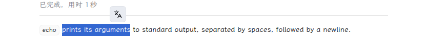
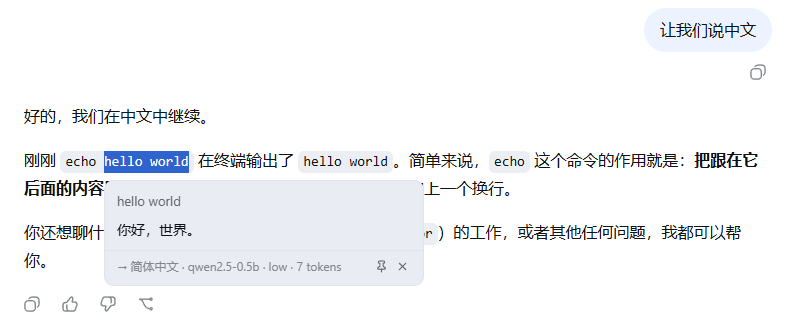
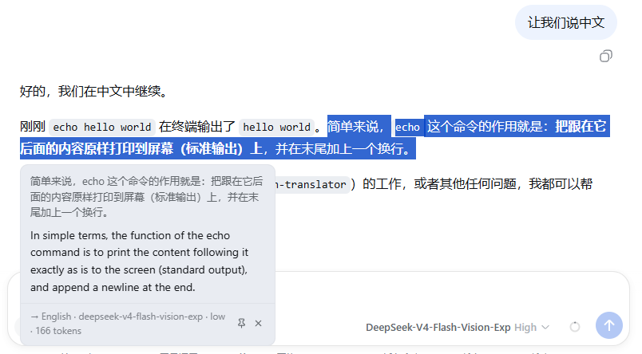
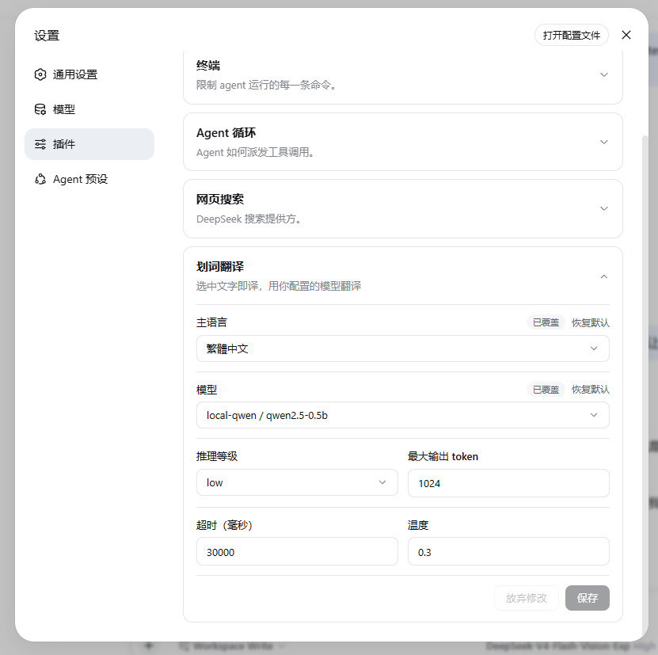
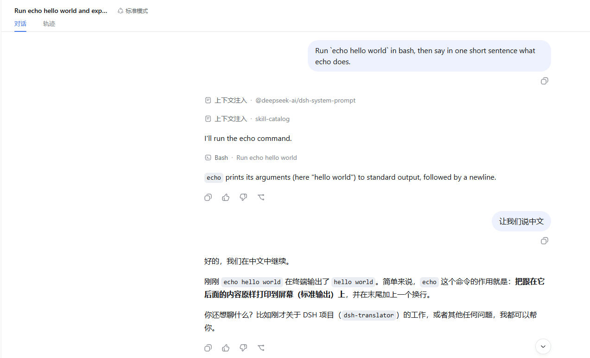

# dsh-translator

Youdao-style word-selection translation for [DeepSeek Harness](https://github.com/deepseek-ai/deepseek-harness) (DSH).

Select any text — a conversation message, the sidebar, an input field — and a floating **「译」** button appears at the selection's top-right corner. Click it to get a translation card. Translations are produced by **the harness's own LLM**: no API keys, no third-party endpoints, your selected text never leaves the model pipeline you already configured.

| English | [中文 README](README.zh.md) |
|---|---|

## Usage

Select text → click the **「译」** button → the translation card appears. Drag the card by its header to move it, or pin it so it can't be dismissed by accident. Click the translation (or the source text, or an error message) to copy it. The card's footer shows the translation direction, the model, the reasoning effort, and the token consumption.

## Features

- Word-selection trigger anywhere in the app; floating button follows the selection, theme-aware (light/dark)
- Automatic direction: text in your configured **primary language** → English; anything else → the primary language
- Primary language configurable: 简体中文 / 繁體中文 / 日本語 / 한국어 / Русский (default 简体中文)
- Config card in DSH settings (Settings → Plugins → 划词翻译): primary language, model (pick one, or leave it empty to follow the session default), reasoning effort (off/low/high/max), timeout, max tokens, temperature — each field shows "overridden / restore default", with staged edits and save/discard
- Translation card: source, direction badge, result, retry on failure; the footer shows model · reasoning effort · tokens
- Click to copy: translation, source text, or error message — with a "已复制 / Copied" hint
- Draggable card: drag it by its header; it stays where you put it
- Pinnable card: locks drag, Esc and click-outside until you close it — one card at a time, no nesting
- Streaming-robust: works on live streaming output (no flicker), and the card stays put when the content scrolls

## Screenshots

Select text → the floating **「译」** button appears at the selection's top-right corner:



Click it → the translation card opens (English → Chinese):



Chinese → English direction is automatic:



Configure it in DSH settings → Plugins → 划词翻译:



Full workflow — select, translate, drag, pin, close:



## Install

From npm:

```sh
dsh plugin --profile web add @nicearrack/dsh-translator@latest
```

From a local checkout:

```sh
dsh plugin --profile web add /path/to/dsh-translator
```

From git:

```sh
dsh plugin --profile web add github:nicearrack/dsh-translator
```

> Git installs run the package's `prepare` build script. pnpm ≥ 10 requires
> one-time authorization: add `allowBuilds: { "@nicearrack/dsh-translator": true }`
> to the profile's `pnpm-workspace.yaml` if the first install is refused.

## Uninstall

```sh
dsh plugin --profile web remove @nicearrack/dsh-translator
```

Restart the instance (`dsh --profile web`) for the removal to take effect.

## License

[MIT](LICENSE)
